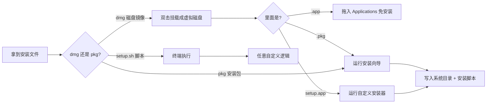
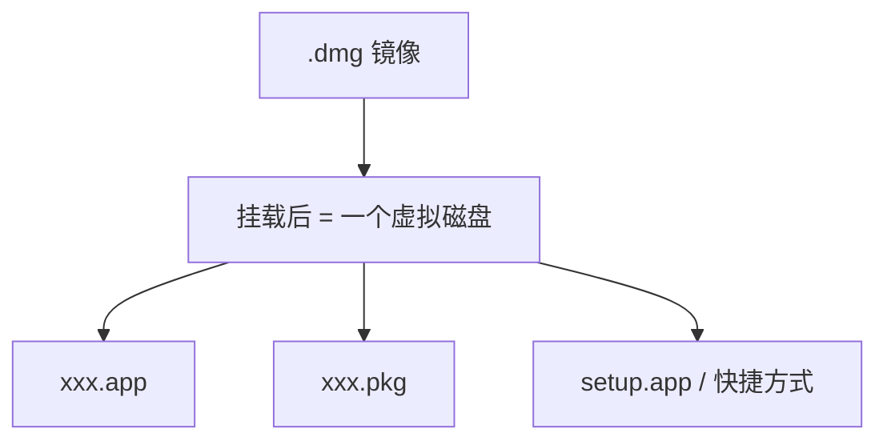
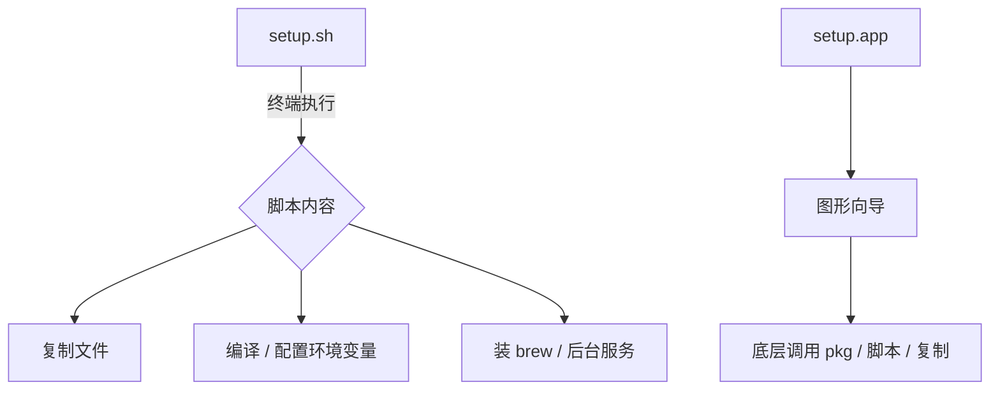

+++
title = 'macOS 软件安装格式全解：dmg、pkg、setup 到底有什么区别？'
date = '2026-10-08T10:00:00+08:00'
slug = 'macos-dmg-pkg-setup'
draft = false
tags = ['macos', 'dmg', 'pkg', '软件安装', '系统原理']
+++

在 Windows 上装软件基本是「双击 setup.exe」一条路走到底，但换到 macOS，你会发现下载回来的是各种花样的文件：`.dmg`、`.pkg`、还有 `setup.sh` / `setup.app`，甚至有的直接是一个 `.app`。它们都能把软件装上，但背后的原理、对系统的侵入程度、以及卸载的干净程度完全不同。

很多人以为「dmg 就是 macOS 的安装包」，这其实是个常见的误解。本文就从底层机制讲清楚这几者的区别，帮你理解它们各自适合什么场景，以及如何安全、干净地安装与卸载。



<!-- more -->

---

## 一、dmg —— 磁盘映像，只是「容器」不是安装包

### 1.1 本质是什么

`.dmg`（Disk Image，磁盘映像）本质上是一个**虚拟磁盘镜像文件**，类似 Windows 的 `.iso`。它把一堆文件打包成一个镜像，双击之后会被系统挂载（mount）成一个临时的虚拟磁盘，在 Finder 里显示为一个可访问的卷。

dmg 本身**不包含任何安装逻辑**，它只是「装东西的盒子」。真正的程序是盒子里的 `.app` 或 `.pkg`。



### 1.2 常见的两种内容

- **拖放式（最常见）**：dmg 里只有一个 `.app` 和一个「应用程序」文件夹快捷方式。安装 = 把 `.app` 拖进 Applications 文件夹。这种也叫「绿色安装」，因为不写系统目录，卸载也最简单——把 app 拖进废纸篓即可。
- **内含安装包**：dmg 里放的是 `.pkg` 或 `setup.app`，需要挂载后再运行里面的安装程序。

### 1.3 特点

| 特点 | 说明 |
|---|---|
| 权限 | 拖放式一般**不需要管理员密码** |
| 侵入性 | 极低，纯复制文件到 `/Applications` |
| 卸载难度 | ✅ 简单，删掉 app 基本干净 |
| 额外能力 | 可加密（带密码的镜像）、可做只读分发 |

> 💡 **小知识**：直接双击挂载后，**不拖进 Applications 也能运行**虚拟盘里的 app。但推出（Eject）dmg 后程序就没了，因为程序本体在虚拟盘里。

---

## 二、pkg —— macOS 原生安装包

### 2.1 本质是什么

`.pkg` 是苹果官方定义的安装包格式，更接近 Windows 的 `.msi`。它内部包含文件清单、安装目标和**安装脚本**（preinstall / postinstall），通过系统的「安装器」（Installer.app）运行，能做的事远超简单复制文件。

```mermaid
graph TD
    A[.pkg 安装包] --> B{Installer.app 解析}
    B --> C[文件清单]
    B --> D[preinstall 脚本]
    B --> E[复制文件到目标目录]
    B --> F[postinstall 脚本]
    E --> G[/usr/local /Library 等系统目录]
    F --> H[注册服务 / 写配置 / 设权限]
```

### 2.2 分两种物理形式

- **flat package（扁平包）**：单个 `.pkg` 文件，现在是主流。
- **bundle package（包目录）**：`.pkg` 其实是一个文件夹包（Finder 里可「显示包内容」查看），较为少见。

### 2.3 特点

| 特点 | 说明 |
|---|---|
| 权限 | ✅ 大多需要管理员密码，可写入系统目录 |
| 侵入性 | 高，文件分散到 `/usr/local`、`/Library` 等多处 |
| 卸载难度 | ⚠️ 较难，只删 app 不干净，会残留配套文件 |
| 典型场景 | 驱动程序、SDK、企业软件、命令行工具 |

> 📌 还有 `.mpkg`（metapackage，元包），是多个 pkg 组合打包，现在已很少见。

### 2.4 怎么查看 pkg 里装了什么

macOS 自带 `pkgutil` 命令，无需装任何东西：

```bash
# 列出某个 pkg 会安装的所有文件
pkgutil --payload-files /path/to/xxx.pkg

# 查看已安装 pkg 的完整信息（receipt）
pkgutil --pkgs
pkgutil --files com.xxx.xxx.pkg

# 反解出 pkg 里的原始内容（到指定目录）
pkgutil --expand-full /path/to/xxx.pkg ./expanded
```

> ⚠️ 安装脚本是 pkg 最大的潜在风险点——恶意 pkg 可以在 postinstall 里执行任意命令。安装来自不可信来源的 pkg 前，建议先用 `pkgutil --expand-full` 展开检查脚本内容。

---

## 三、setup —— 自定义安装程序（.sh / .app）

macOS **没有 `.setup` 后缀**。你在网上看到「setup」时，通常指下面两种之一：

### 3.1 setup.sh —— shell 脚本安装器

放在 dmg / zip 里或直接分发，需要在终端执行：

```bash
chmod +x setup.sh
./setup.sh
```

- 常见于开发工具、自建软件、一键配置脚本。
- 逻辑完全自定义：可能是复制文件、编译源码、写 `.zshrc`/`.bashrc`、安装 Homebrew 包、甚至注册后台服务。
- **风险最高**：脚本可以执行任何命令，尤其是带 `sudo` 的脚本。**永远先打开看一遍脚本内容再执行**，不要盲目 `sudo ./setup.sh`。

### 3.2 setup.app —— 图形化自定义安装器

第三方把自己做的安装程序打包成 `.app`。表面看是图形界面，底层其实大多还是调用 pkg、脚本或复制文件。行为不固定，介于「绿色」和「深度侵入」之间。



---

## 四、横向对比总表

| 维度 | dmg（拖放 app） | dmg 内含 pkg | pkg | setup.sh / setup.app |
|---|---|---|---|---|
| 本质 | 磁盘镜像容器 | 镜像 + 安装包 | 原生安装包 | 自定义脚本/程序 |
| 是否需要密码 | ❌ 一般不需要 | ✅ 大多需要 | ✅ 大多需要 | ⚠️ 视脚本而定 |
| 侵入系统程度 | 极低 | 中 | 高 | 不定（可能最高） |
| 卸载难度 | ✅ 简单 | ⚠️ 较难 | ⚠️ 较难 | ❗ 最难，位置不确定 |
| 有无安装脚本 | 无 | 有 | 有 | 有（完全自定义） |
| 典型场景 | 普通应用、开源软件 | 官方套件 | 驱动、SDK、企业软件 | 开发工具、自建软件 |
| 安全风险 | 低 | 中 | 中高 | 最高 |

---

## 五、常见误区与安全建议

### 5.1 三个高频误区

> ❌ **误区一：dmg 就是 macOS 的安装包**
> ✅ 纠正：dmg 只是容器，真正的程序是里面的 `.app` 或 `.pkg`。

> ❌ **误区二：pkg 装的 app，从启动台删除就干净了**
> ✅ 纠正：启动台只删除 `/Applications` 里的 app 本体，**不会清理 pkg 脚本放到 `/Library`、`/usr/local` 的配套文件**。

> ❌ **误区三：setup 一定是官方安装器**
> ✅ 纠正：mac 没有统一 setup 规范，`setup.sh` 完全可以是任意的第三方脚本。

### 5.2 安全使用建议

1. **优先 dmg 拖放式**：最干净、卸载最省心，适合普通软件。
2. **pkg 用于需要写系统目录的工具**：驱动、SDK、命令行工具、企业软件。
3. **setup.sh 先读源码再执行**：尤其警惕 `sudo` 和 `curl | sh` 一键安装。
4. **只装经过公证（notarization）的软件**：未公证的应用会被 Gatekeeper 拦截，提示「无法打开，因为来自未识别开发者」。
5. **卸载不干净的残留**：可用 `pkgutil --pkgs` 查已装包，或借助 AppCleaner 类工具清扫偏好文件与缓存。

---

## 六、总结

一句话记住三者的关系：

> **dmg 是「盒子」——只负责把东西打包带给你；pkg 是「安装器」——会真正写入系统并运行脚本；setup 是「自定义脚本」——行为由作者完全掌控，最灵活也最需谨慎。**

日常装普通软件，看到 dmg 直接拖；装驱动和底层工具，用 pkg；遇到 setup 脚本，先看清楚再动手。理解了这些区别，你不仅能选对安装方式，也知道出了问题该怎么干净地卸载。
