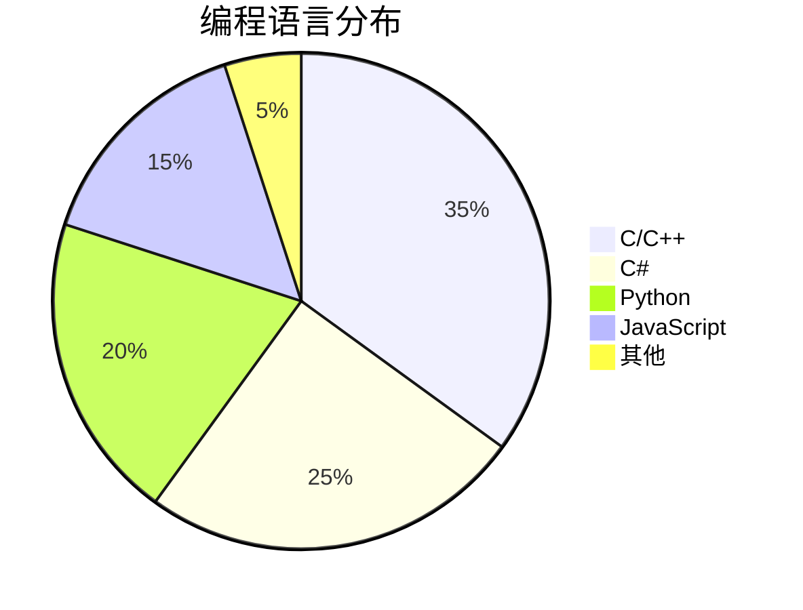

+++
date = '2026-08-11T10:56:00+08:00'
draft = false
title = 'Mermaid 图表测试'
tags = ['Mermaid', '测试']
+++

这是一篇用于验证 Mermaid 图表功能是否正常工作的测试文章。

<!-- more -->

## 流程图 (Flowchart)


graph TD
    A[开始] --> B{是否准备好？}
    B -->|是| C[执行任务]
    B -->|否| D[等待]
    D --> B
    C --> E[检查结果]
    E -->|通过| F[完成]
    E -->|失败| G[修复问题]
    G --> C


## 时序图 (Sequence Diagram)


sequenceDiagram
    participant 客户端
    participant 服务端
    participant 数据库

    客户端->>服务端: GET /api/posts
    服务端->>数据库: SELECT * FROM posts
    数据库-->>服务端: 返回数据
    服务端-->>客户端: JSON 响应


## 类图 (Class Diagram)


classDiagram
    class Blog {
        +String title
        +String description
        +getPosts() List
        +publish() void
    }
    class Post {
        +String title
        +Date date
        +String content
        +String[] tags
        +render() String
    }
    class Author {
        +String name
        +String email
        +String avatar
    }
    Blog "1" --> "*" Post : 包含
    Post "*" --> "1" Author : 属于


## 甘特图 (Gantt Chart)


gantt
    title 博客搭建计划
    dateFormat  YYYY-MM-DD
    section 基础设施
    初始化 Hugo 项目         :done,    infra1, 2025-07-01, 1d
    配置 PaperMod 主题       :done,    infra2, 2025-07-02, 1d
    配置 GitHub Actions      :done,    infra3, 2025-07-03, 1d
    section 内容创作
    写第一篇文章             :done,    content1, 2025-07-15, 1d
    添加搜索和归档           :done,    content2, 2025-07-20, 2d
    Mermaid 测试             :active,  content3, 2026-08-11, 1d
    section 未来计划
    持续写作                 :          future1, 2026-08-12, 30d


## 状态图 (State Diagram)


stateDiagram-v2
    [*] --> 草稿
    草稿 --> 审核中 : 提交审核
    审核中 --> 已发布 : 审核通过
    审核中 --> 草稿 : 退回修改
    已发布 --> 已归档 : 归档
    已归档 --> [*]


---

如果以上所有图表都能正常渲染，说明 Mermaid 功能配置正确。

## 新方式：代码块语法（无需 shortcode）

直接使用 `mermaid` 代码块，无需 shortcode 包裹：

如果这个饼图也能渲染，说明两种方式可以共存。
